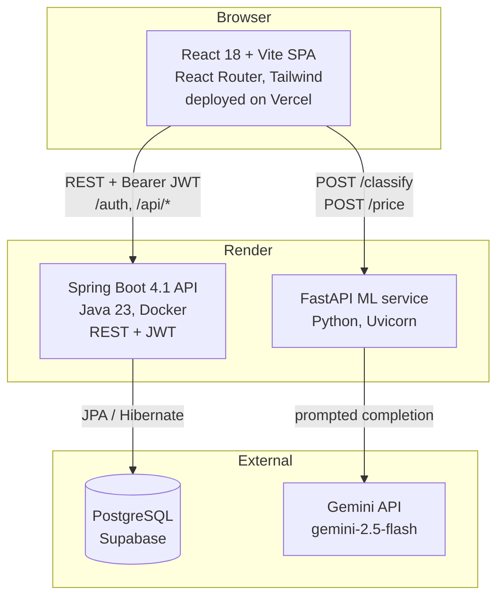
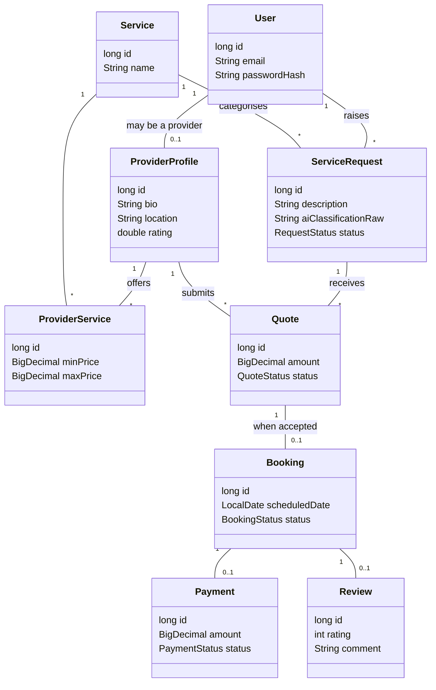

# UbuntuLink

A local services marketplace for South Africa. A customer describes a problem in plain language
("my kitchen sink is leaking"), an AI layer classifies the job and estimates a fair price, and the
platform matches them with rated local providers - plumbers, electricians, cleaners - who send
quotes. Accepting a quote creates a booking, which ends in a payment and a review.

Built for the Geekulcha hackathon. This is an MVP: payments are mocked, and matching is by service
category rather than geolocation.

| | |
|---|---|
| Frontend | https://geekulcha-hackathon26.vercel.app |
| Backend API | https://ubuntulink-backend-yhhu.onrender.com |
| ML service | Render, see `ML_SERVICE_URL` |

---

## The flow

**Customer:** register or log in, describe the job in free text, let the AI classify it and suggest
a price range, browse matching providers, submit a service request, compare incoming quotes, accept
one, then pay and review after the work is done.

**Provider:** register, set up a profile with the services offered and a price range for each,
browse open service requests, submit quotes, and move accepted bookings through to completion.

One account can be both. A `User` becomes a provider by gaining a `ProviderProfile`.

---

## System overview



The frontend calls the ML service **directly** rather than through the backend. The backend stores
whatever classification the frontend produced alongside the service request, so the AI layer stays
out of the request path for everything else.

Authentication is email and password with Argon2 hashing; the API issues a JWT and every route
except `/auth/**` requires a valid `Authorization: Bearer <token>` header. Controllers also check
ownership, so a user cannot accept someone else's quote or advance someone else's booking.

## Domain model



---

## Stack

| Layer | Technology |
|---|---|
| Frontend | React 18, Vite, Tailwind, React Router |
| Backend | Java 23, Spring Boot 4.1.1 (web, data-jpa, security, validation) |
| Database | PostgreSQL on Supabase, schema managed by Hibernate `ddl-auto=update` |
| ML service | Python, FastAPI, Uvicorn, Gemini via the OpenAI-compatible protocol (gemini-2.5-flash) |
| Auth | Email and password, Argon2 hashing, JWT (HS256) |
| Hosting | Vercel (frontend), Render (backend and ML service) |

## Layout

```
backend/     Spring Boot API - controller > service > repository, JPA entities, DTOs
python/      FastAPI ML service - POST /classify, POST /price, GET /health
frontend/    React SPA - pages/{auth,customer,provider}, api clients, AuthContext
01_Database/ Schema CSVs and ERD
02_Diagrams/ Use case and account-creation diagrams
render.yaml  Render blueprint for both backend services
```

## API surface

`GET /api/services`, `POST /api/service-requests`, `GET /api/service-requests/{mine,open,id}`,
`GET /api/services/{id}/providers`, `GET|PATCH /api/provider-profiles/me`, `POST /api/quotes`,
`POST /api/bookings/accept-quote/{quoteId}`, `PATCH /api/bookings/{id}/status`,
`POST /api/bookings/{id}/review`, `POST /api/bookings/{id}/payment/mock-charge`,
`GET /api/users/me`, plus `POST /auth/register` and `POST /auth/login`.

springdoc-openapi is on the classpath, so `/swagger-ui.html` exists - but it sits behind the same
filter as everything else, so it needs a bearer token like any other non-`/auth` route.

---

## Running it locally

Full setup, including every key and account you need, is in [INSTRUCTIONS.md](INSTRUCTIONS.md).
The short version, three terminals:

```bash
cd backend  && ./mvnw spring-boot:run                       # port 8080, needs backend/.env
cd python   && uvicorn app.main:app --reload --port 8000    # needs python/.env
cd frontend && npm install && npm run dev                   # port 5173
```

## Deploying

Pushes to `master` trigger [.github/workflows/cd.yml](.github/workflows/cd.yml), which builds all
three services, redeploys both Render services pinned to that commit, waits for them to report
live, and smoke-tests them. Vercel deploys the frontend itself from the same push.

- [KEYS.md](KEYS.md) - every key and token, where to get it, which of the four places it belongs in
- [CD_PIPELINE.md](CD_PIPELINE.md) - how the pipeline works and how to troubleshoot it
- [DEPLOYMENT.md](DEPLOYMENT.md) - first-time platform setup
- [PROJECT.md](PROJECT.md) - current status, decisions, and the full gap list

## Scope

Deliberately not built for the hackathon MVP: real payment processing (`MockPaymentService` always
succeeds), geolocation-based matching, provider vetting, in-app messaging, and disputes. There is
no meaningful automated test coverage yet. PROJECT.md section 9 lists the gaps in detail.
